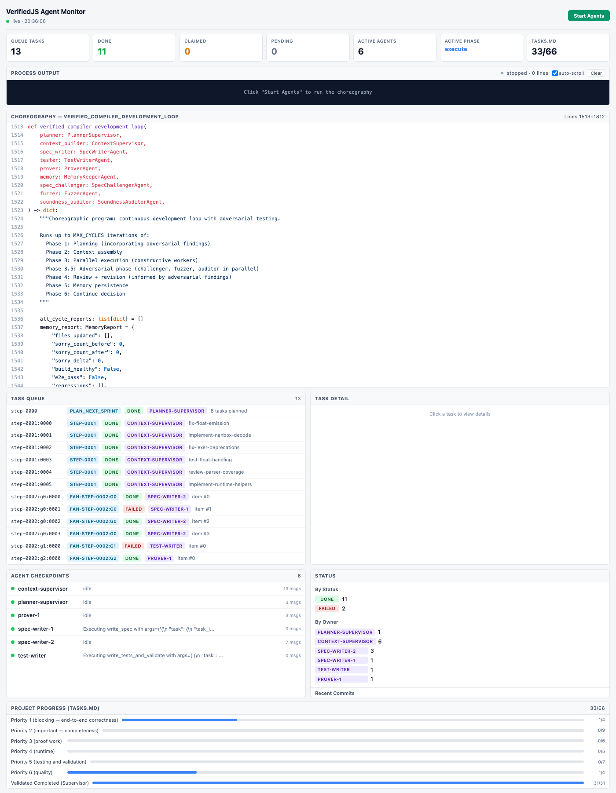

# VerifiedJS Agent Monitor

Live dashboard for the multi-agent compiler choreography. Reads from the SQLite task queue (`.agent_state/state.db`), shows per-agent progress through the choreography phases, and can start/stop the agent process directly from the browser.



## Quickstart

```bash
# One command — builds frontend if needed, starts Flask on :5001
./monitoring/run_monitor.sh

# Or via the project script entry point
uv run verifiedjs-monitor

# Or directly
.venv/bin/python -m monitoring.backend.app
```

Open **http://127.0.0.1:5001**

## Features

- **Choreography code viewer** — syntax-highlighted source of `verified_compiler_development_loop` with per-agent cursor badges showing which phase each agent is at
- **Task queue** — live view of all effectful tasks (plan, scatter, fan_out) with status/owner/phase badges
- **Task detail pane** — click any task to see planned subtasks, context bundles, guidance, proof blockers, verdicts
- **Agent checkpoints** — checkpoint state, handoff text, message count per agent
- **Process control** — Start/Stop buttons to run `agents/verified_compiler_agents.py` with live stdout streaming in a terminal panel
- **Live updates** — SSE stream pushes DB snapshot every 3s; terminal output streams line-by-line
- **TASKS.md progress** — section-by-section progress bars from the project task file

## Architecture

```
Browser <──SSE──> Flask backend <──sqlite3──> .agent_state/state.db
                       │
                       ├── /api/snapshot     (full state)
                       ├── /api/stream       (SSE live)
                       ├── /api/agents/start (POST, spawns agent process)
                       ├── /api/agents/stop  (POST, SIGINT)
                       └── /api/agents/log/stream (SSE, stdout lines)
```

The Flask server serves the built Svelte frontend as static files and auto-builds it on first run if `dist/` doesn't exist.

## Development

For frontend hot-reload during development:

```bash
# Terminal 1: Flask backend
.venv/bin/python -m monitoring.backend.app --no-build

# Terminal 2: Vite dev server (proxies /api/* to Flask)
cd monitoring/frontend && npm run dev
# Open http://127.0.0.1:5174
```

## Configuration

| Env var | Default | Description |
|---------|---------|-------------|
| `MONITOR_HOST` | `127.0.0.1` | Flask bind address |
| `MONITOR_PORT` | `5001` | Flask port |
| `VERIFIEDJS_ROOT` | auto-detected | Project root path |
| `VERIFIEDJS_MODEL` | `anthropic/claude-opus-4-20250514` | Model for agent process |
| `VERIFIEDJS_MAX_CYCLES` | `10` | Max choreography cycles |
